# 📊 Analyse Exploratoire des Données (EDA) - Turbines et Alternateurs

Ce dossier contient les notebooks Jupyter d'analyse exploratoire pour les datasets de monitoring de turbines à gaz et d'alternateurs de centrales électriques tunisiennes. Les données proviennent de systèmes SCADA industriels.

---

## 📁 Datasets Analysés

| Notebook | Dataset | Lignes | Colonnes | Résolution | Description |
|----------|---------|--------|----------|------------|-------------|
| [01_APM_Alternateur_ML_EDA.ipynb](01_APM_Alternateur_ML_EDA.ipynb) | APM_Alternateur_ML.csv | 525,591 | 42 | 1 minute | Alternateur principal - haute résolution |
| [02_APM_Alternateur_10min_ML_EDA.ipynb](02_APM_Alternateur_10min_ML_EDA.ipynb) | APM_Alternateur_10min_ML.csv | 52,560 | 42 | 10 minutes | Alternateur principal - agrégé |
| [03_APM_Chart_ML_EDA.ipynb](03_APM_Chart_ML_EDA.ipynb) | APM_Chart_ML.csv | 525,661 | 42 | 1 minute | Turbine à gaz - haute résolution |
| [04_APM_Chart_10min_ML_EDA.ipynb](04_APM_Chart_10min_ML_EDA.ipynb) | APM_Chart_10min_ML.csv | 52,567 | 42 | 10 minutes | Turbine à gaz - agrégé |
| [05_TG1_Sousse_ML_EDA.ipynb](05_TG1_Sousse_ML_EDA.ipynb) | TG1_Sousse_ML.csv | ~500,000 | 50+ | Variable | Turbine Sousse - original |
| [06_TG1_Sousse_1min_ML_EDA.ipynb](06_TG1_Sousse_1min_ML_EDA.ipynb) | TG1_Sousse_1min_ML.csv | 2,195,381 | 91 | 1 minute | Turbine Sousse - 1 minute |

---

## 🔬 Notebooks APM Alternateur (01-02)

### Variables de Puissance et Charge

| Variable | Unité | Description | Plage Typique |
|----------|-------|-------------|---------------|
| `MODE_TAG_1` | MW | Puissance active générée | 0 - 124 MW |
| `REACTIVE_LOAD` | MVAR | Charge réactive | -47 à +58 MVAR |
| `P_ACTIVE_MW` | MW | Puissance active (calculée) | 0 - 124 MW |
| `P_REACTIVE_MVAR` | MVAR | Puissance réactive | Variable |
| `P_APPARENT_MVA` | MVA | Puissance apparente | Calculée |
| `POWER_FACTOR` | - | Facteur de puissance | 0 - 1 |

### Variables de Contrôle

| Variable | Unité | Description | Plage |
|----------|-------|-------------|-------|
| `SPEED_CTRL_pct` | % | Contrôle de vitesse | 0 - 100% |
| `SPEED_rpm` | RPM | Vitesse de rotation | 0 - 3000 RPM |

### Températures du Stator (9 capteurs)

| Variable | Unité | Phase | Capteur |
|----------|-------|-------|---------|
| `STATOR_PHASE_A_WINDING_TEMP_1_degC` | °C | A | 1 |
| `STATOR_PHASE_A_WINDING_TEMP_2_degC` | °C | A | 2 |
| `STATOR_PHASE_A_WINDING_TEMP_3_degC` | °C | A | 3 |
| `STATOR_PHASE_B_WINDING_TEMP_1_degC` | °C | B | 1 |
| `STATOR_PHASE_B_WINDING_TEMP_2_degC` | °C | B | 2 |
| `STATOR_PHASE_B_WINDING_TEMP_3_degC` | °C | B | 3 |
| `STATOR_PHASE_C_WINDING_TEMP_1_degC` | °C | C | 1 |
| `STATOR_PHASE_C_WINDING_TEMP_2_degC` | °C | C | 2 |
| `STATOR_PHASE_C_WINDING_TEMP_3_degC` | °C | C | 3 |

**Plage typique:** 60°C - 115°C en fonctionnement normal

### Températures de l'Air

| Variable | Unité | Description |
|----------|-------|-------------|
| `AMBIENT_AIR_TEMP_C` | °C | Température ambiante (10-45°C) |
| `ENCLOSED_HOT_AIR_TEMP_1/2_degC` | °C | Air chaud enceinte |
| `ENCLOSED_COLD_AIR_TEMP_1/2_degC` | °C | Air froid enceinte |

### Variables Électriques

| Variable | Unité | Description | Valeur Nominale |
|----------|-------|-------------|-----------------|
| `TERMINAL_VOLTAGE_kV` | kV | Tension aux bornes | ~15.5 kV |
| `FREQUENCY_Hz` | Hz | Fréquence du réseau | 50 Hz |

### Variables Temporelles (Features Engineered)

| Variable | Type | Description |
|----------|------|-------------|
| `Year` | int | Année |
| `Month` | int | Mois (1-12) |
| `Day` | int | Jour du mois (1-31) |
| `Hour` | int | Heure (0-23) |
| `Minute` | int | Minute (0-59) |
| `DayOfWeek` | int | Jour de la semaine (0=Lundi) |
| `Quarter` | int | Trimestre (1-4) |

### 📈 Visualisations Générées

#### Distribution des Variables Principales
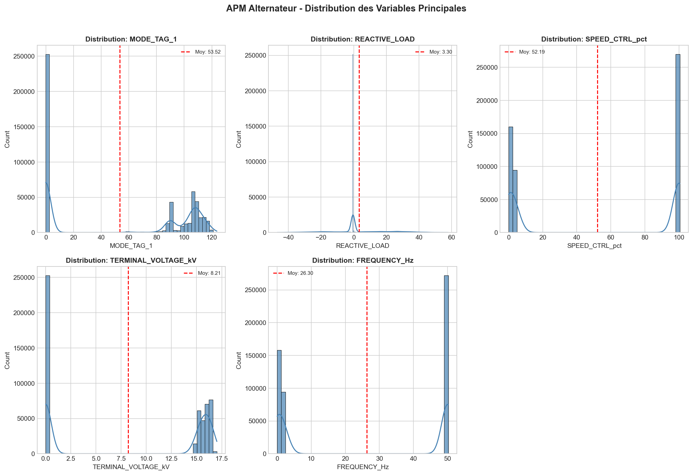
- Histogrammes avec KDE pour MODE_TAG_1, REACTIVE_LOAD, SPEED_CTRL_pct, TERMINAL_VOLTAGE_kV, FREQUENCY_Hz
- Ligne rouge = moyenne

#### Températures du Stator
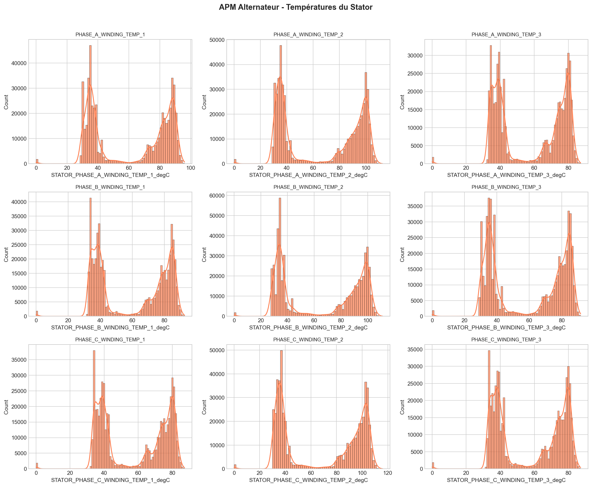
- Grid 3x3 des 9 capteurs de température
- Distribution par phase (A, B, C)

#### Matrice de Corrélation
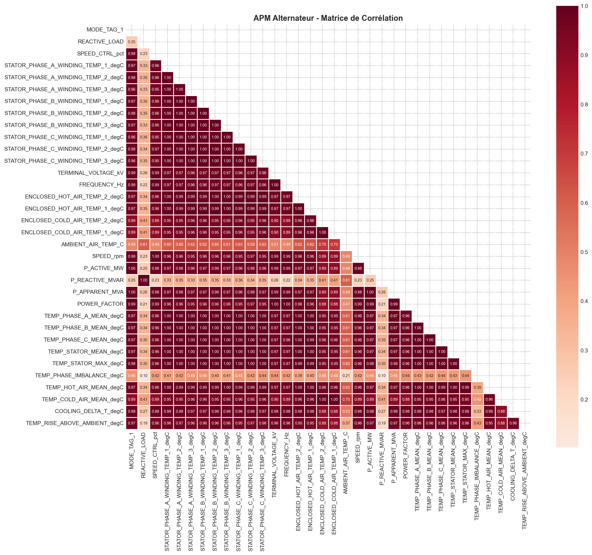
- Heatmap triangulaire
- **Corrélations clés:** Puissance-Température (~0.85-0.90), Températures inter-phases (>0.95)

#### Box Plots - Détection Outliers
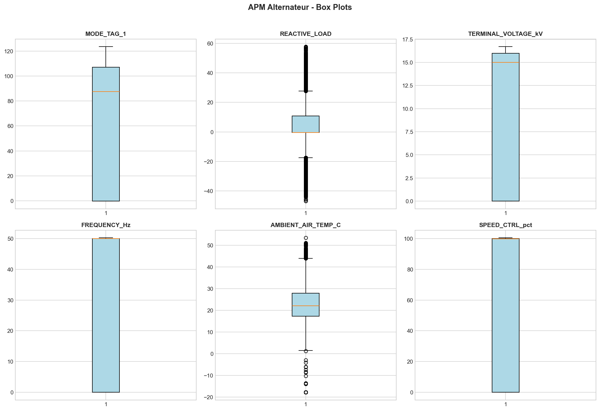
- 6 variables principales
- Détection visuelle des valeurs aberrantes

---

## 📊 Notebooks APM Chart (03-04)

### Variables Principales
- **MODE_TAG_1**: Puissance active (MW)
- **REACTIVE_LOAD**: Charge réactive (MVAr)
- **SPEED_CTRL_pct**: Contrôle de vitesse (%)
- **TERMINAL_VOLTAGE_kV**: Tension terminale (kV)
- **FREQUENCY_Hz**: Fréquence (Hz)
- **STATOR_PHASE_*_WINDING_TEMP**: Températures stator (9 capteurs)
- **AMBIENT_AIR_TEMP_C**: Température ambiante

### 📈 Visualisations Générées

#### Distribution des Variables
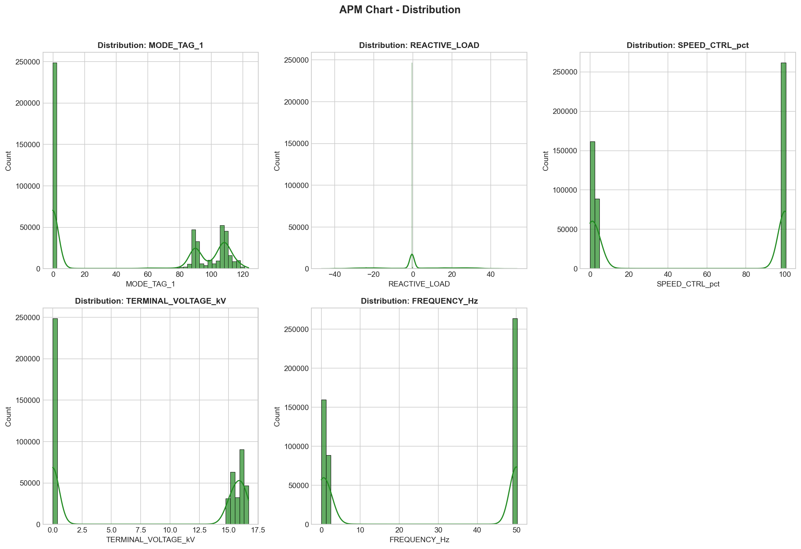
- Histogrammes des 5 variables principales
- Distribution similaire à l'alternateur

#### Températures du Stator
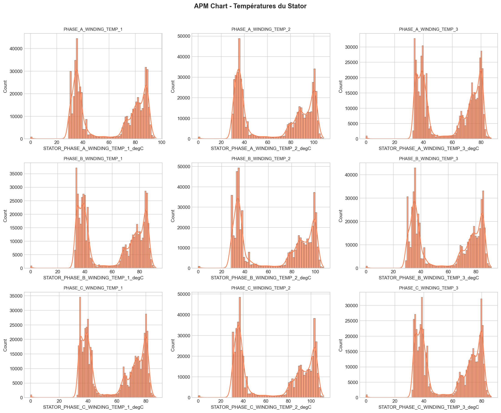
- Grid 3x3 des capteurs de température
- Comparaison entre phases A, B, C

#### Matrice de Corrélation
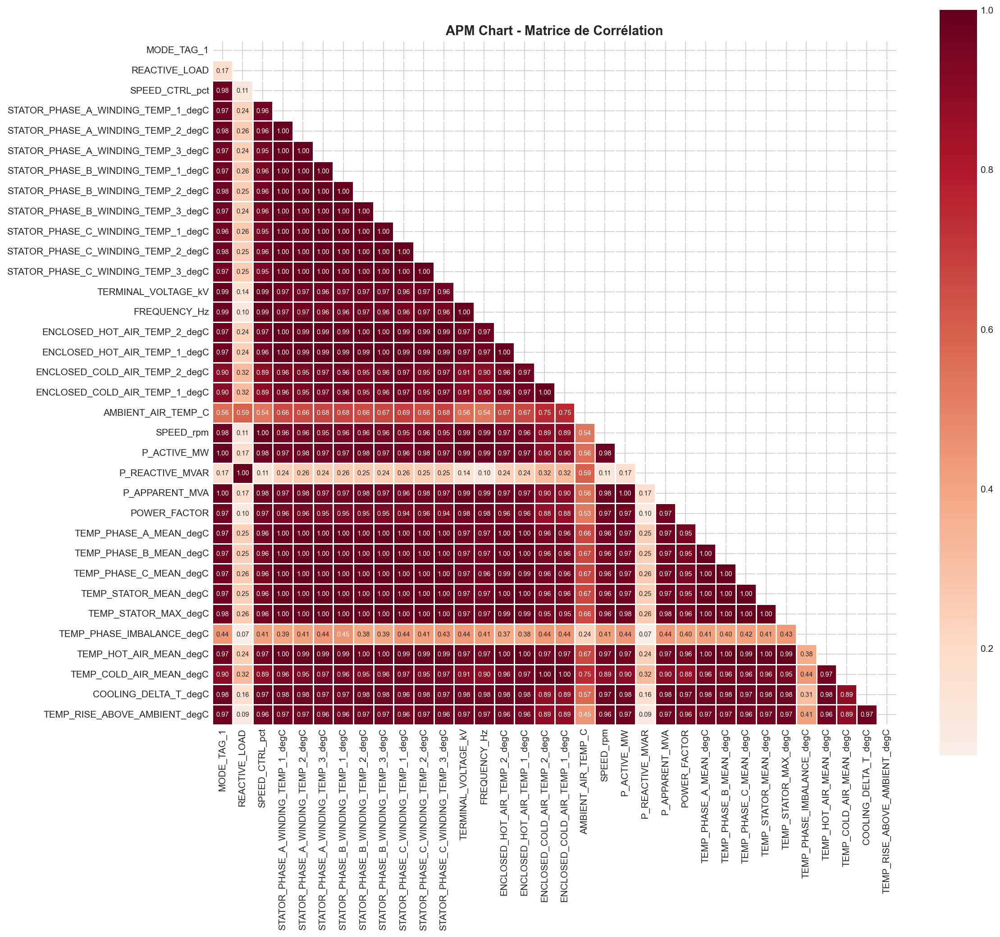
- Heatmap des corrélations
- Fortes corrélations température-puissance

---

## 🔌 Notebooks TG1 Sousse - Décharges Partielles (05-06)

### Structure des Données
4 canaux de mesure (CH1, CH2, CH3, CH4), chacun avec:

| Métrique | Description | Unité |
|----------|-------------|-------|
| CURRENT_ABS/NEG/POS | Courant de décharge | µA |
| DISCHARGE_RATE_* | Taux de décharge | nC²/s |
| MAX_CHARGE_* | Charge maximale | nC |
| MEAN_CHARGE_* | Charge moyenne | nC |
| PULSE_COUNT_* | Nombre d'impulsions | - |

### 📈 Visualisations Générées

#### Distribution des Variables TG1 Sousse
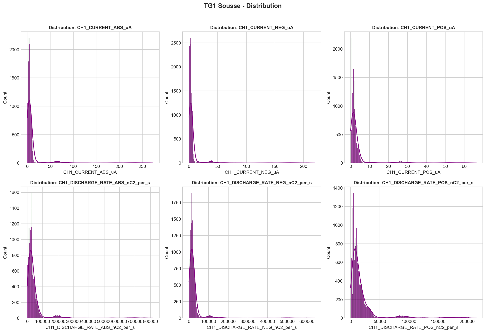
- Histogrammes des variables principales
- 6 variables clés du dataset

#### Matrice de Corrélation TG1 Sousse
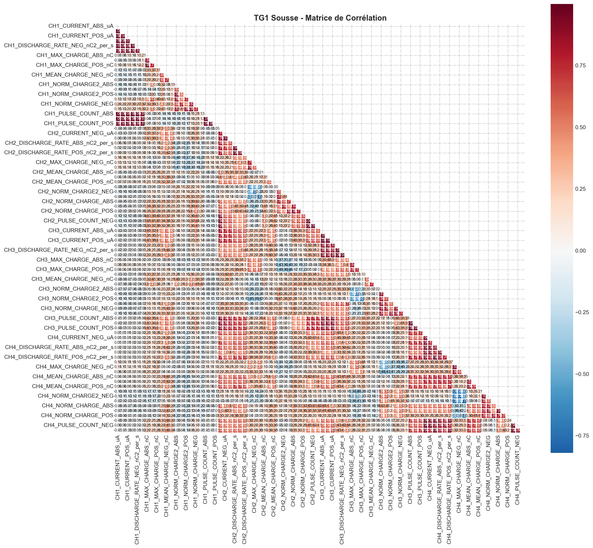
- Heatmap complète des corrélations
- Identification des variables fortement corrélées

#### Distribution TG1 Sousse 1-min
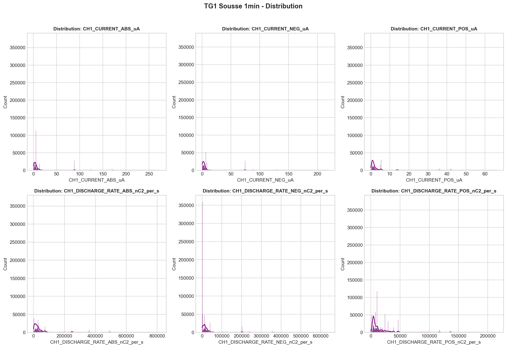
- Données haute résolution (2.2M lignes)

#### Corrélation TG1 Sousse 1-min
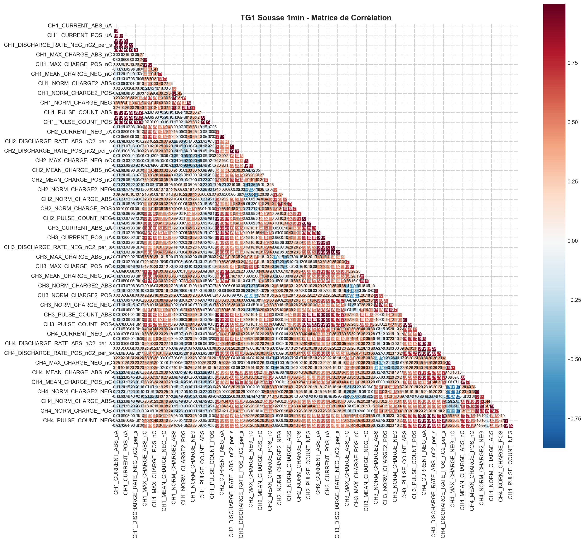
- Matrice de corrélation complète

---

## 📊 Statistiques Principales

### APM Alternateur (résumé)

| Variable | Moyenne | Écart-type | Min | Max |
|----------|---------|------------|-----|-----|
| MODE_TAG_1 (MW) | 53.52 | 52.28 | -0.21 | 123.65 |
| REACTIVE_LOAD (MVAR) | 3.30 | 16.28 | -46.90 | 57.97 |
| TERMINAL_VOLTAGE (kV) | 8.21 | 7.92 | 0.00 | 17.02 |
| FREQUENCY (Hz) | 26.30 | 24.35 | 0.00 | 50.15 |
| STATOR_TEMP_A1 (°C) | 60.75 | 24.74 | 0.00 | 96.07 |

### Qualité des Données
| Dataset | Valeurs Manquantes | % Complet | Outliers |
|---------|-------------------|-----------|----------|
| APM Alternateur | 0 | 100% | ~5% |
| APM Alternateur 10min | 0 | 100% | ~5% |
| APM Chart | 0 | 100% | ~3% |
| APM Chart 10min | 0 | 100% | ~3% |
| TG1 Sousse | 0 | 100% | 6-10% |
| TG1 Sousse 1min | 0 | 100% | 6-10% |

---

## 🔍 Insights Clés

### 1. Patterns de Fonctionnement
- **Mode bimodal**: Les machines fonctionnent soit à l'arrêt (0 MW), soit proche de la pleine charge
- **Cycles journaliers**: Pics de demande le matin et en fin d'après-midi
- **Saisonnalité**: Consommation plus élevée en été (climatisation)

### 2. Relations Température-Puissance
- Corrélation linéaire forte entre puissance et température du stator (~0.85-0.90)
- Le refroidissement (COOLING_DELTA_T) augmente avec la charge
- L'élévation de température suit la puissance avec un léger retard thermique

### 3. Stabilité du Réseau
- Fréquence très stable à 50 Hz (±0.5 Hz)
- Tension maintenue dans les limites nominales
- Facteur de puissance généralement > 0.85

### 4. Potentiel de Maintenance Prédictive
- Les températures anormales peuvent prédire des défaillances
- L'asymétrie entre phases peut indiquer un problème
- Le ratio température/puissance est un indicateur de santé

### Observations APM Alternateur
- Forte corrélation entre les températures des phases (>0.95)
- Puissance active: 0-124 MW (distribution bimodale)
- Fréquence stable autour de 50 Hz
- Température stator: 60-115°C en fonctionnement

### Observations TG1 Sousse (Décharges Partielles)
- CH1 a le courant moyen le plus élevé (~12 µA)
- Corrélation linéaire forte entre courant et taux de décharge
- Distribution asymétrique (nombreuses valeurs faibles)
- Outliers significatifs (8-10% selon le canal)

---

## 🔧 Technologies Utilisées

- **Polars**: Chargement rapide des gros datasets (5-10x vs pandas)
- **Pandas**: Manipulation et analyse des données
- **Matplotlib**: Visualisations de base
- **Seaborn**: Visualisations statistiques
- **NumPy**: Calculs numériques

---

## 💾 Pour Reproduire les Analyses

```bash
# Activer l'environnement
source .venv/bin/activate

# Installer les dépendances
pip install pandas numpy matplotlib seaborn polars pyarrow jupyter

# Lancer Jupyter
jupyter notebook
```

## 📸 Exporter les Plots en Images

1. **Exécuter tous les notebooks** (Run All dans VS Code ou Jupyter)

2. **Sauvegarder les notebooks avec outputs**:
   - VS Code: Ctrl+S après exécution
   - Jupyter: File > Save and Checkpoint

3. **Exécuter le script d'export**:
```bash
cd data_describe
python export_plots.py
```

Les images seront sauvegardées dans le dossier `plots/`.

> **Note**: Les plots sont générés dynamiquement lors de l'exécution des notebooks. 
> Pour voir les visualisations, exécutez les cellules dans Jupyter/VS Code.

---

## 📁 Structure des Fichiers

```
data_describe/
├── README.md                              # Ce fichier
├── 01_APM_Alternateur_ML_EDA.ipynb        # EDA Alternateur (1-min)
├── 02_APM_Alternateur_10min_ML_EDA.ipynb  # EDA Alternateur (10-min)
├── 03_APM_Chart_ML_EDA.ipynb              # EDA Chart (1-min)
├── 04_APM_Chart_10min_ML_EDA.ipynb        # EDA Chart (10-min)
├── 05_TG1_Sousse_ML_EDA.ipynb             # EDA TG1 (agrégé)
├── 06_TG1_Sousse_1min_ML_EDA.ipynb        # EDA TG1 (1-min, 2.2M rows)
├── export_plots.py                        # Extraction plots des notebooks
├── generate_all_plots.py                  # Génération automatique plots
└── plots/                                 # Images PNG générées
    ├── 01_apm_alternateur_distribution.png
    ├── 01_apm_alternateur_temperatures.png
    ├── 01_apm_alternateur_correlation.png
    ├── 01_apm_alternateur_boxplots.png
    ├── 02_apm_alternateur_10min_*.png
    ├── 03_apm_chart_*.png
    ├── 04_apm_chart_10min_*.png
    ├── 05_tg1_sousse_*.png
    └── 06_tg1_sousse_1min_*.png
```

---

## 📝 Notes

- Les données ont été prétraitées et nettoyées (aucune valeur manquante)
- Les features temporelles ont été extraites du timestamp original
- Des features calculées ont été ajoutées pour faciliter l'analyse ML
- La fréquence d'échantillonnage varie selon les datasets (1-min ou 10-min)
- Le notebook 06 utilise **Polars** pour charger 2.2M lignes rapidement

---

## 📄 Licence

Données industrielles - Projet de stage.

---

*Dernière mise à jour: Février 2026*
